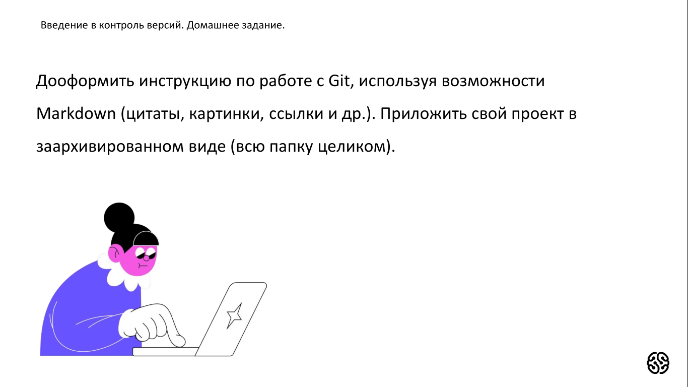
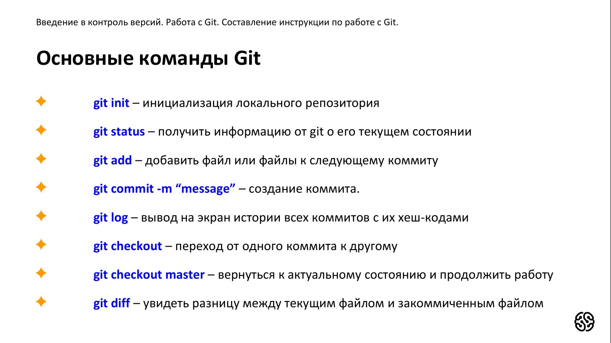
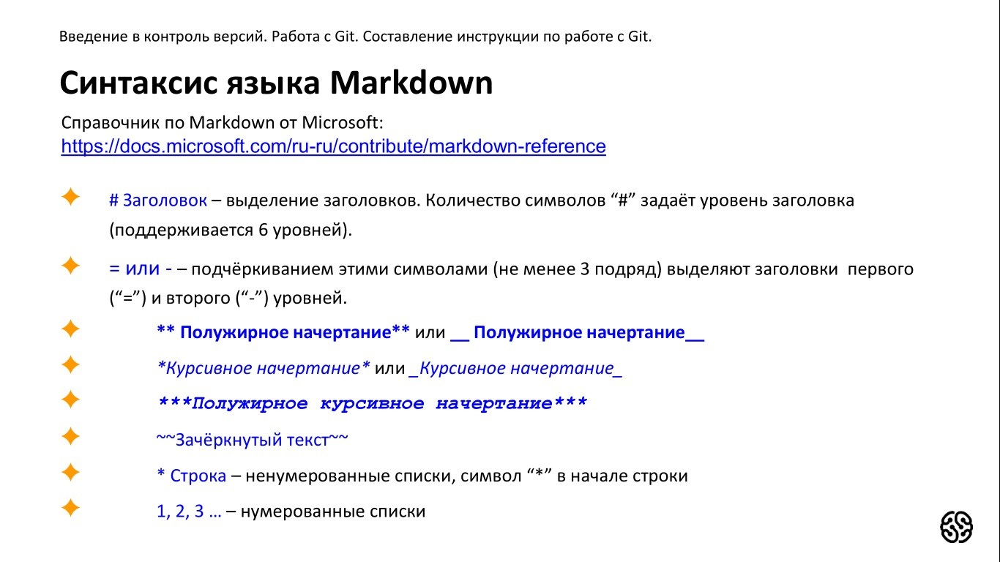
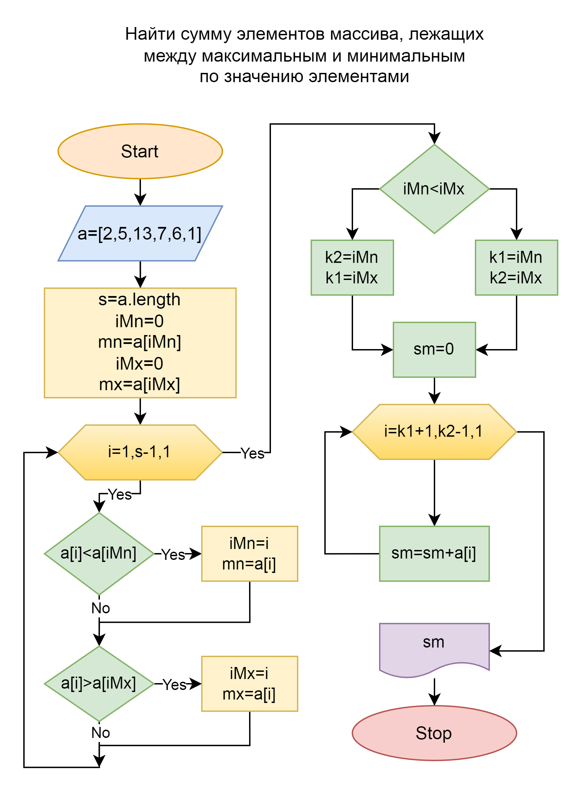

# Инструкция для работы с Git и удалёнными репозиториями

## Что такое Git?
Git - это одна из реализаций распределённых систем контроля версий, имеющая как и локальные, так и удалённые репозитории. Является самой популярной реализацией систем контроля версий в мире.
## Подготовка репозитория
Для создание репозитория необходимо выполнить команду *git init*  в папке с репозиторием и у Вас создаться репозиторий (появится скрытая папка .git)

## Создание коммитов

### Git add
Для добавления измений в коммит используется команда *git add*. Чтобы использовать команду *git add* напишите *git add <имя файла>*

### Просмотр состояния репозитория
Для того, чтобы посмотреть состояние репозитория используется команда *git status*. Для этого необходимо в папке с репозиторием написать *git status*, и Вы увидите были ли измения в файлах, или их не было.

### Создание коммитов
Для того, чтобы создать коммит(сохранение) необходимо выполнить команду *git commit*. Выполняется она так: *git commit -m "<сообщение к коммиту>*. Все файлы для коммита должны быть ***ДОБАВЛЕНЫ*** и сообщение к коммиту писать ***ОБЯЗАТЕЛЬНО***.

## Перемещение между сохранениями
Для того, чтобы перемещаться между коммитами, используется команда *git checkout*. Используется она в папке с пепозиторием следующим образом: *git checkout <номер коммита>*

## Журнал изменений
Для того, чтобы посмтреть все сделанные изменения в репозитории, используется команда *git log*. Для этого достаточно выполнить команду *git log* в папке с репозиторием

## Ветки в Git

### Создание ветки

Для того, чтобы создать ветку, используется команда *git branch*. Делается это следующим образом в папке с репозиторием: *git branch <название новой ветки>*

## Слияние веток

Для того чтобы дабавить ветку в текущую ветку используется команда *git merge <name branch>*

## Удаление веток
Для удаления ветки ввести команду "git branch -d 'name branch'"

## Синтаксис языка Markdown

* **# Заголовок** - выделение заголовков. Количество символов "#" задает уровень заголовка (поддерживается 6 уровней).

* **= или -** - подчёркиваем этими символами(не менее 3 подряд) выделяют заголовки первого("=") и второго ("-") уровней.

* ** **Полужирное начертание** ** или __ __Полужирное начертание__ __

*  **Курсивное начертание* * или _ _Курсивное начертание_ _

* *** ***Полужирное курсивное начертание*** ***
* ~~ ~~Зачёркнутый текст~~ ~~
* ***Строка** - ненумерованные списки символ " * " в начале строки
* **1,2,3,...** - нумерованные списки

Полезные ссылки:

[Синтаксис языка Markdown](https://gbcdn.mrgcdn.ru/uploads/asset/4936261/attachment/470041fa232b40d654ed8161f7913089.jpeg "Cинтаксис MarkDown")

[Основные команды Git](https://gbcdn.mrgcdn.ru/uploads/asset/4936260/attachment/a4f09a0ea30ba998755d8b85e9d496fc.jpeg "Команды Git")

[Руководство по оформлению Markdown файлов](https://gist.github.com/Jekins/2bf2d0638163f1294637)

# Введение в программирование

## Алгоритм решения задачи

### Блок схема

## Примеры кода на языке Js

### Нахождение среднего арефметического среди всех элеметов массива.

`num=[2,5,13,7,6,4]`

`size=num.length`

`sum=0`

`avg=0`

`i=0`

`while(i<size)`{

    sum=sum+num[i]
    i++
}
`avg=sum/size`

`console.log(avg)`

# ***Продолжение следует***